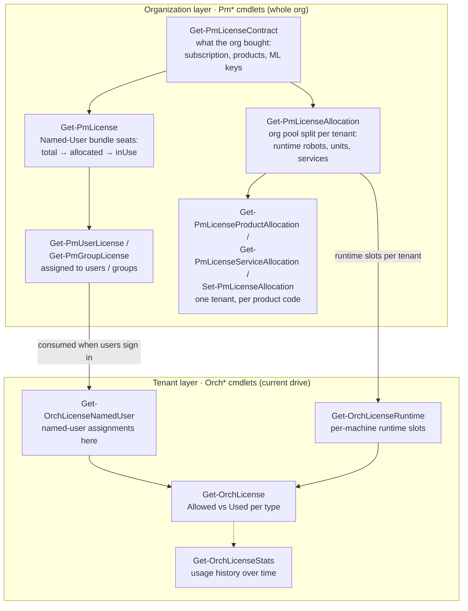

# Licensing Guide

UiPath licensing is exposed by UiPathOrch through **two families of cmdlets that work at
two different layers**. Understanding which layer answers which question is the key to
using them.

| Layer | Cmdlet prefix | Scope | Web equivalent |
|-------|---------------|-------|----------------|
| **Organization** | `*-Pm*License*` | The whole Automation Cloud **organization** | **Admin → Licenses** (account/org screens) |
| **Tenant** | `*-OrchLicense*` | A single **tenant** (the drive you are on) | **Tenant → License** |

- **Organization (`Pm*`)** answers *"what did we buy, and how is it parcelled out?"* —
  the contract, the named-user bundles, the per-tenant allocation, and who/which group
  holds which bundle. These call the Platform Management / portal APIs, so they need an
  organization-level sign-in (see [Getting Started](00-GettingStarted.md)); they return
  the same data regardless of which tenant drive you point `-Path` at.
- **Tenant (`Orch*`)** answers *"what is this tenant allowed, and what is it using right
  now?"* — the allowed-vs-used counts, the named-user assignments, the per-machine
  runtime slots, and the usage history.

Two license *kinds* run through everything:

- **User bundles (Named User)** — a per-person seat such as `ATTUNU` (Attended – Named
  User) or `RPADEVPRONU` (Automation Developer – Named User). Bought at the org level,
  assigned to users/groups (`Pm*`), consumed when those users sign in.
- **Runtime licenses** — per-**machine** execution slots (Unattended, NonProduction,
  Testing). Allocated from the org pool to each tenant (`Get-PmLicenseAllocation`), then
  consumed machine-by-machine inside the tenant (`Get-OrchLicenseRuntime`).

---

## Organization layer — `Pm*` cmdlets

### Read

| Cmdlet | Answers | Key output fields |
|--------|---------|-------------------|
| `Get-PmLicenseContract` | The account-level **contract** — what was purchased | `BundleCode`, `LicenseCode`, `LicenseStatus`, `SubscriptionPlan`, `StartDate`/`EndDate`, `GracePeriod`, plus `Products`, `Templates`, `Entitlements`, `MlKeys` collections |
| `Get-PmLicenseInventory` | The org **inventory dashboard** (Robots & Services summary) | `ProductAllocations`, `UserLicensingBundles`, `EntitlementUsages`, `AvailableServices`, `MlKeys` |
| `Get-PmLicense` | **Named-User bundles** and their seat counts | `code`, `name`, `allocated`, `total`, `inUse` |
| `Get-PmLicenseAllocation` | **Per-tenant allocation** of the org pool (Robots & Services tab) | `tenant`, `unattendedRobot`, `nonProductionRobot`, `testingRobot`, `dataServiceUnit`, `services`, … |
| `Get-PmLicenseProductAllocation` | One tenant's allocation **per product code**, including the codes at 0 | `code`, `total`, `allocated`, `isConsumable`, `unlimited`, `startDate`/`endDate`, `Tenant` |
| `Get-PmLicenseServiceAllocation` | The same allocation **grouped by the service** that grants each code (what one write re-sends together) | `serviceType`, `code`, `quantity`, `used`, `available`, `totalUnits`, `type`, `Tenant` |
| `Get-PmUserLicense` | The **licensed users** and the bundles they hold | `email`/`name`, `lastInUse`, `userBundleLicenses`, `orphan` |
| `Get-PmGroupLicense` | The **licensed groups** and their bundles | `name`, `userBundleLicenses`, `useExternalLicense`, `orphan` |

`Get-PmLicense` accepts `-Code` to filter to one bundle and `-HasCapacity` to show only
bundles with seats still free (`allocated` < `total`). `Get-PmLicenseAllocation` and
`Get-PmLicenseProductAllocation` accept `-Tenant` to focus on one tenant, and the latter
also `-Code` to focus on one product. `Get-PmUserLicense`/`Get-PmGroupLicense` support
`-ExportCsv` / `-CsvEncoding`, and `Get-PmGroupLicense` adds `-ExpandAllocation` to expand
each group's member allocations.

> **`orphan = True`** marks a license still held by a user/group that no longer exists —
> the first thing to reclaim when freeing seats.

### Write

| Cmdlet | Effect |
|--------|--------|
| `Add-PmUserLicense -Email <user> -License <code>` | Assign one or more bundles to a user |
| `Remove-PmUserLicense -Email <user> -License <code>` | Unassign bundles from a user |
| `Add-PmGroupLicense -GroupName <g> -License <code>` | Assign a bundle to a group |
| `Remove-PmGroupLicense -GroupName <g> -License <code>` | Unassign a bundle from a group |
| `Remove-PmGroupLicenseAllocation -GroupName <g> -UserName <u>` | Drop one user's allocation under a group |
| `Remove-PmLicensedUser -Email <user>` | Drop a user from the licensed-users set entirely |
| `Remove-PmLicensedGroup -GroupName <g>` | Drop a group from the licensed set |
| `Set-PmLicenseAllocation <tenant> -AppTestRobot <n>` | Allocate robot runtimes / consumable units to a tenant |

> **`Set-PmLicenseAllocation` merges.** The API replaces a service's whole allocation, so
> the cmdlet re-sends the tenant's current codes with the requested ones overlaid. Calling
> the endpoint directly with a partial `products` array zeroes every code left out —
> `Get-PmLicenseServiceAllocation` shows which codes travel together in one write.

---

## Tenant layer — `Orch*` cmdlets

| Cmdlet | Answers | Key output fields |
|--------|---------|-------------------|
| `Get-OrchLicense` | What the tenant is **allowed vs using** | `Usage` (per-type `Used`/`Allowed`/`Percent`, shown by default), the raw `Allowed` / `Used` dicts, `SubscriptionCode`/`Plan`, `ExpireDateLocal`, `GracePeriod`, `UserLicensingEnabled`, `IsExpired` |
| `Get-OrchLicenseNamedUser -RobotType <t>` | **Named-user** license assignments | `UserName`, `IsLicensed`, `MachinesCount`, `LastLoginDate` |
| `Get-OrchLicenseRuntime -RobotType <t>` | **Per-machine runtime** slots | `MachineName`, `Runtimes`, `RobotsCount`, `ExecutingCount`, `IsOnline`, `Enabled`, `MachineScope` |
| `Get-OrchLicenseStats -Last <period>` | **Historical** usage over time | `robotType`, `count`, `timestamp` |

`RobotType` is one of `Unattended`, `NonProduction`, `Testing`, `Attended`,
`Development`, … (the same robot types shown on the tenant license screen). To turn a
machine's runtime license on or off, use
`Enable-OrchLicenseRuntime` / `Disable-OrchLicenseRuntime -RobotType <t> -Key <machine>`.

> **Dates are Unix epoch seconds.** `Get-OrchLicense` returns `ExpireDate` /
> `GracePeriodEndDate` as integers — convert with
> `[DateTimeOffset]::FromUnixTimeSeconds($lic.ExpireDate).LocalDateTime`.

---

## Common tasks

All examples are run from a tenant drive (e.g. `PS Orch1:\>`); pass `-Path Orch1:` from a
`C:\` prompt instead if you prefer not to `cd` first.

**How many Named-User seats are left, per bundle?**

```powershell
PS Orch1:\> Get-PmLicense | Select-Object code, name, allocated, total,
    @{ Name = 'free'; Expression = { $_.total - $_.allocated } }
# or only the bundles that still have capacity:
PS Orch1:\> Get-PmLicense -HasCapacity
```

**Who holds a particular bundle (e.g. Attended – Named User)?**

```powershell
PS Orch1:\> Get-PmUserLicense | Where-Object { $_.userBundleLicenses -contains 'ATTUNU' }
```

**Reclaim orphaned licenses (held by users/groups that no longer exist):**

```powershell
PS Orch1:\> Get-PmUserLicense | Where-Object orphan | Select-Object id, lastInUse, userBundleLicenses
# then drop each from the licensed set:
PS Orch1:\> Get-PmUserLicense | Where-Object orphan | ForEach-Object { Remove-PmLicensedUser -Email $_.email }
```

**How is the org pool split across tenants?**

```powershell
PS Orch1:\> Get-PmLicenseAllocation | Select-Object @{ N = 'Tenant'; E = { $_.tenant.name } },
    unattendedRobot, nonProductionRobot, testingRobot, dataServiceUnit
```

**Give a tenant an App Testing runtime and the units Autonomous Test Execution needs:**

```powershell
PS Orch1:\> Set-PmLicenseAllocation DefaultTenant -AppTestRobot 1 `
    -PlatformUnits 3000 -ScreenPlayRuns 50000 -TestHeals 2000
# what does the tenant hold now, per product code?
PS Orch1:\> Get-PmLicenseProductAllocation DefaultTenant | Where-Object allocated -gt 0
# the runtime still has to be put on a machine and the machine in a folder:
PS Orch1:\> Update-OrchMachine AppTestMachine -AppTestSlots 1
PS Orch1:\> Add-OrchFolderMachine -Path Orch1:\Shared -Name AppTestMachine
```

**What is this tenant allowed vs using?**

`Get-OrchLicense` prints a per-type usage summary by default (the same "Used of Allowed
(%)" the license page shows). For scripting, each row is on the `Usage` property:

```powershell
PS Orch1:\> Get-OrchLicense | Select-Object -ExpandProperty Usage
```

```output
Type           Used Allowed Percent
----           ---- ------- -------
Unattended        3       5      60
TestAutomation    3       5      60
NonProduction     4       5      80
```

The raw `Allowed` / `Used` dictionaries remain available, and `ExpireDateLocal` /
`GracePeriodEndDateLocal` expose the epoch dates as `DateTime`.

**Which machines hold a runtime slot, and are they online?**

```powershell
PS Orch1:\> Get-OrchLicenseRuntime | Select-Object RobotType, MachineName, Runtimes, RobotsCount, IsOnline, Enabled
```

**Activate / deactivate a machine's runtime license (the *Active* toggle):**

```powershell
PS Orch1:\> Disable-OrchLicenseRuntime NonProduction m2 -WhatIf   # preview
PS Orch1:\> Disable-OrchLicenseRuntime NonProduction m2           # Active -> off
PS Orch1:\> Enable-OrchLicenseRuntime  NonProduction m2           # Active -> on
```

`Enable-OrchLicenseRuntime` / `Disable-OrchLicenseRuntime` flip the same `Enabled` flag
shown by `Get-OrchLicenseRuntime` (the *Active* toggle on the license page). The first
argument is the `RobotType`, the second the machine `Key`; both accept wildcards and tab
completion, and `-WhatIf` previews the change.

**Usage trend over the last month:**

```powershell
PS Orch1:\> Get-OrchLicenseStats -Last Month
```

**Assign / free a Named-User bundle:**

```powershell
PS Orch1:\> Add-PmUserLicense -Email ytsuda@gmail.com -License ATTUNU
PS Orch1:\> Remove-PmUserLicense -Email ytsuda@gmail.com -License ATTUNU
```

---

## How the layers fit together




## See also

- [Getting Started](00-GettingStarted.md) — signing in (organization vs tenant)
- [CSV Export & Import](05-CsvExportImport.md) — `-ExportCsv` on the `Pm*` license cmdlets
